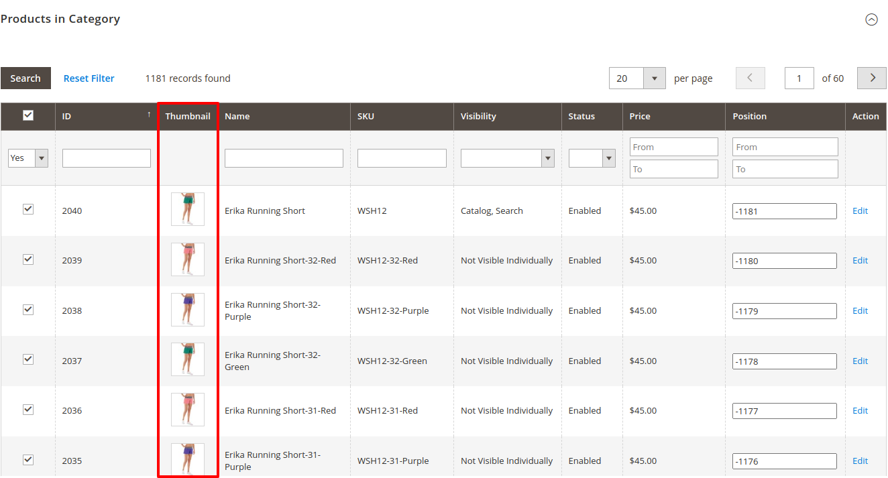

# Magento 2 Admin Category Product Thumbnail Module
The mavenbird/module-admin-category-product-thumbnail module for Magento 2 enhances product management by providing an intuitive interface for displaying product thumbnails in category grids within the admin panel. This extension streamlines the process of viewing and managing product images directly from the category management interface.

## Key Features:
- **Product Thumbnails:**
Display product images directly in the category management grids for easy identification.
- **Enhanced Admin Interface:**
Improved category grid interface with integrated product thumbnails.
- **Configurable Display:**
Option to customize thumbnail sizes and grid layout to fit business needs.
- **Performance Optimization:**
Efficient image handling to ensure smooth admin panel performance.
- **Search and Filter:**
Advanced search and filtering options to quickly find and manage products within categories.

## Benefits:
- **Efficiency:**
Quickly identify products in category grids with visual thumbnails.
- **Usability:**
Enhanced admin interface improves the user experience for managing products.
- **Flexibility:**
Customize thumbnail display settings to match your store’s requirements.
- **Performance:**
Optimized image handling ensures that the admin panel remains responsive.

## Compatibility:
This extension is compatible with Magento 2.4.X (PHP - 8.1 - 8.3) version.

## Installation:
*Install via composer (recommend)* - 

Easy installation process with step-by-step instructions provided for hassle-free setup.
~~~~~~~~~~~~~~~~~~~~~
php bin/magento module:enable mavenbird/module-admin-category-product-thumbnail
php bin/magento setup:upgrade
php bin/magento setup:static-content:deploy
php bin/magento cache:flush
Manual Installation:
Download the latest release from GitHub releases.
~~~~~~~~~~~~~~~~~~~~~

## Upgrade/Update Module:
Run the following command in Magento 2 root folder for easy update -
~~~~~~~~~~~~~~~~~~~~~
php bin/magento module:enable mavenbird/module-admin-category-product-thumbnail
php bin/magento setup:upgrade
php bin/magento setup:static-content:deploy
php bin/magento cache:flush
~~~~~~~~~~~~~~~~~~~~~

## Customization Options:

## Support:
Dedicated support team available to assist with installation, customization, and any other queries or concerns.
*[support@mavenbird.com](mailto:support@mavenbird.com)* 

## Get Started:
Enhance your Magento 2 store's stock management capabilities with the mavenbird/module-admin-category-product-thumbnail module. Simplify stock updates, improve accuracy, and streamline operations today!

*Thank you!*